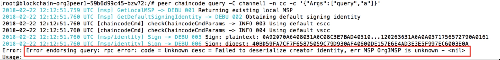
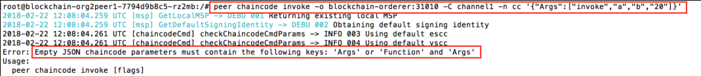
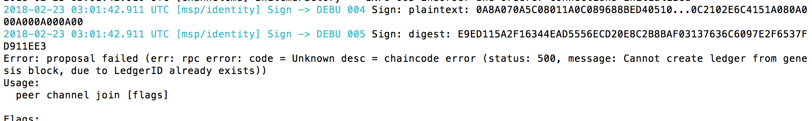
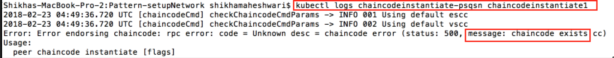
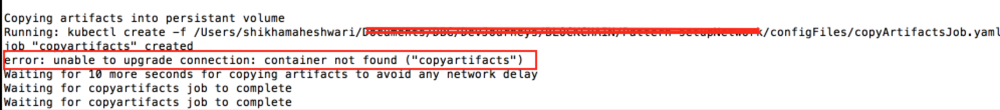

Troubleshooting
===============

* Always start your network fresh. Use the script `deleteNetwork.sh` to delete any pre-existing jobs/pods etc.

* If you see below error, then environment is not set properly and therefore kubectl commands will not work. Ensure you have logged into IBM Cloud and have set your KUBECONFIG environment variable.
  ```
  $ kubectl get pods
  The connection to the server localhost:8080 was refused - did you specify the right host or port?
  ```
  
 * If you see the error
 ```error: SchemeError(io.k8s.apimachinery.pkg.apis.meta.v1.APIGroup): invalid object doesn't have additional properties```

 We have seen this problem when the server version is latest 1.12.x or greater but client version is 1.10.x. You need to upgrade kubectl version at client side then it will work as expected.

 You can issue the following command

```brew link --overwrite kubernetes-clicd 2019```

* If you see below error, it means this peer has not joined the channel and so your query will not work.

  

  You may need to run the following command:

  ```
  $ ibmcloud ks cluster-config --cluster <cluster name>
  $ export KUBECONFIG=<directory where .yml resides>/kube-config-hou02-mycluster.yml

  ```
  
* If you see something similar to the following:

  
  
  It shows there is some error in command. For example, in this snapshot `-c` is missing before passing arguments.
  
* If you see the below error,

  
  
  There is something wrong with the setup. You would like to do setup from a fresh.
  
* For debugging purposes, if you want to inspect the logs of any container, then run the following command.

  ```
   $ kubectl get pods --show-all                  # Get the name of the pod
   $ kubectl logs [pod name]                      # if pod has one container
   $ kubectl logs [pod name] [container name]     # if pod has more than one container
  ```
  
* If you see something like this for chaincode instantiation,

  
  
  It means chaincode has been instantiated already on the peer. Retrying of the same will fail with this error. You can ignore
  this message and continue with your transactions (invoke/query).
  
* If you see error as shown below:

  

  It is intermittent issue and might occur because of network. Delete the network and retry afresh after sometime. 
