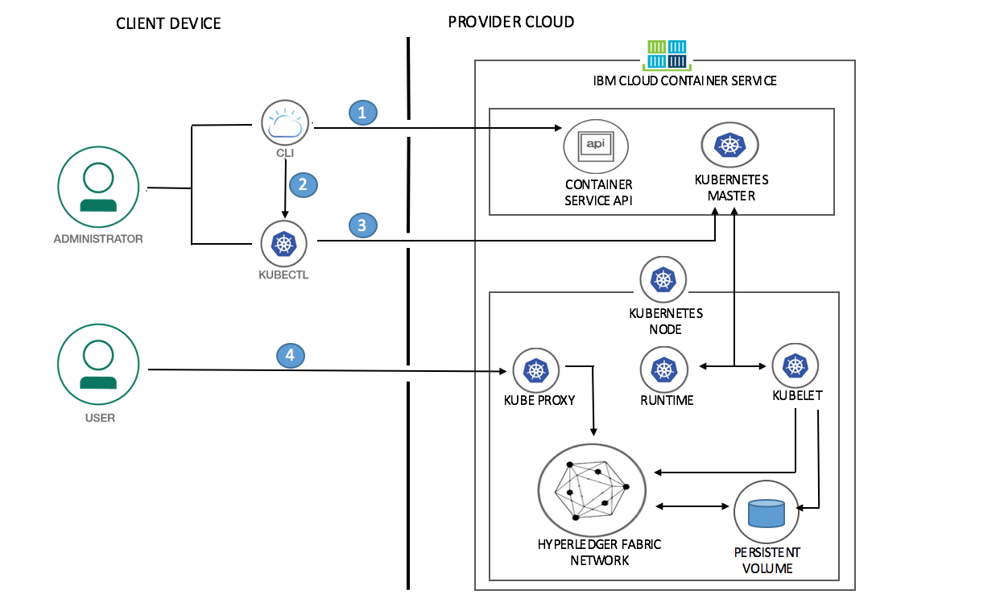
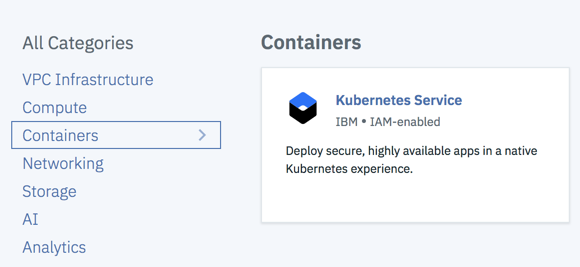
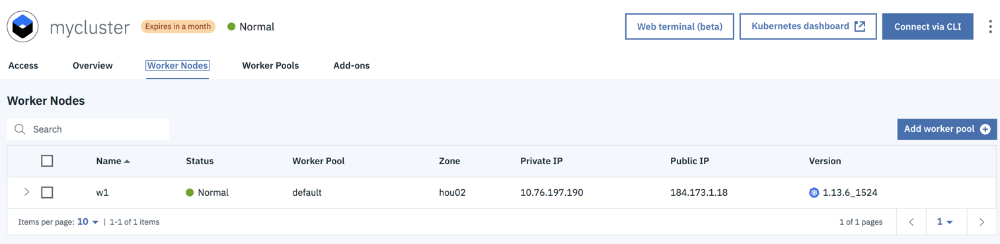
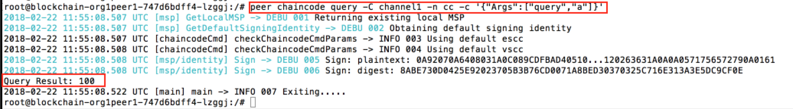
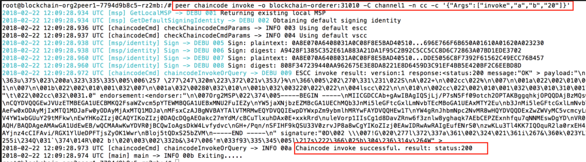
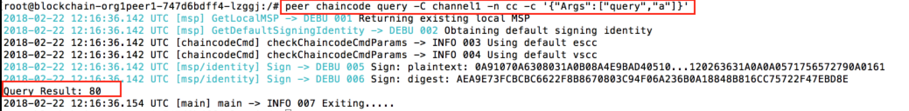
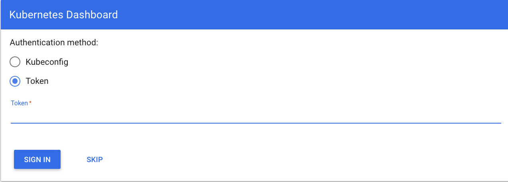
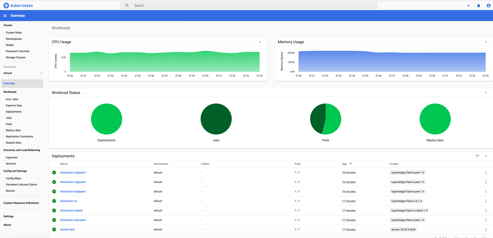

*Read this in other languages: [中国](README-cn.md).*

# Deploy the Blockchain network using Kubernetes APIs on IBM Cloud

*Read this in other languages: [한국어](README-ko.md).*

Blockchain is a shared, immutable ledger for recording the history of transactions. The Linux Foundation’s Hyperledger Fabric, the software implementation of blockchain IBM is committed to, is a permissioned network. For developing any blockchain use-case, the very first thing is to have a development environment for Hyperledger Fabric to create and deploy the application. Hyperledger Fabric network can be setup in multiple ways. 
* [Hyperledger Fabric network On-Premise](http://hyperledger-fabric.readthedocs.io/en/release-1.0/build_network.html)
* Using [Blockchain as a service](https://console.bluemix.net/catalog/services/blockchain) hosted on [IBM Cloud](https://console.bluemix.net/). IBM Cloud provides you Blockchain as a service with a Starter Membership Plan and Enterprise Membership Plan.
* Hyperledger Fabric network using [Kubernetes APIs]((https://console.bluemix.net/containers-kubernetes/catalog/cluster)) on [IBM Cloud Container Service](https://console.bluemix.net/containers-kubernetes/catalog/cluster)

This code pattern demonstrates the steps involved in setting up your business network on **Hyperledger Fabric using Kubernetes APIs on IBM Cloud Container Service**. 

Hosting the Hyperledger Fabric network on IBM Cloud provides you many benefits like multiple users can work on the same setup, the setup can be used for different blockchain applications, the setup can be reused and so on. Please note that the blockchain network setup on Kubernetes is good to use for demo scenarios but for production, it is recommended to use IBM Blockchain as a service hosted on IBM Cloud.

#### Kubernetes Cluster

[IBM Cloud Container Service](https://console.bluemix.net/containers-kubernetes/catalog/cluster) allows you to create a free cluster that comes with 2 CPUs, 4 GB memory, and 1 worker node. It allows you to get familiar with and test Kubernetes capabilities. However they lack capabilities like persistent NFS file-based storage with volumes.

To setup your cluster for maximum availability and capacity, IBM Cloud allows you to create a fully customizable, production-ready cluster called _standard cluster_. _Standard clusters_ allow highly available cluster configurations such as a setup with two clusters that run in different regions, each with multiple worker nodes. Please see https://console.bluemix.net/docs/containers/cs_planning.html#cs_planning_cluster_config to review other options for highly available cluster configurations.

This pattern uses a _free cluster_ provided by IBM Cloud and it can be used for proof-of-concept purpose. This pattern provides you the scripts to automate the process for setting up Hyperledger Fabric network using Kubernetes APIs on IBM Cloud.

When the reader has completed this pattern, they will understand how to:

* modify configuration files according to their network topology
* deploy the hyperledger fabric network on Kubernetes cluster

## Flow

  

1. Log in to IBM Cloud CLI and initialize IBM Cloud Container Service plugin.
2. Set context for Kubernetes cluster using CLI and download Kubernetes configuration files. After downloading configuration files, set KUBECONFIG environment variable.
3. Run script to deploy your hyperledger fabric network on Kubernetes cluster.
4. Access Kubernetes dashboard.

## Included components

* [Hyperledger Fabric](https://hyperledger-fabric.readthedocs.io/): Hyperledger Fabric is a platform for distributed ledger solutions underpinned by a modular architecture delivering high degrees of confidentiality, resiliency, flexibility and scalability.

* [IBM Cloud Container Service](https://console.bluemix.net/containers-kubernetes/catalog/cluster): IBM Container Service enables the orchestration of intelligent scheduling, self-healing, and horizontal scaling.

## Featured technologies

* [Blockchain](https://en.wikipedia.org/wiki/Blockchain): A blockchain is a digitized, decentralized, public ledger of all transactions in a network.

* [Kubernetes Cluster](https://kubernetes.io/docs): In Kubernetes Engine, a container cluster consists of at least one cluster master and multiple worker machines called nodes. A container cluster is the foundation of Kubernetes Engine.

## Watch the Video

[](https://youtu.be/DFYk6XaMHc0)

## Kubernetes Concepts Used
* [Kubernetes Pods](https://kubernetes.io/docs/concepts/workloads/pods/pod/) - Pods represent the smallest deployable units in a Kubernetes cluster and are used to group containers that must be treated as a single unit.
* [Kubernetes Jobs](https://kubernetes.io/docs/concepts/workloads/controllers/jobs-run-to-completion/) - A job creates one or more pods and ensures that a specified number of them successfully terminate. As pods successfully complete, the job tracks the successful completions.
* [Kubernetes Deployment](https://kubernetes.io/docs/concepts/workloads/controllers/deployment/) - A deployment is a Kubernetes resource where you specify your containers and other Kubernetes resources that are required to run your app, such as persistent storage, services, or annotations.
* [Kubernetes Services](https://kubernetes.io/docs/concepts/services-networking/service/) - A Kubernetes service groups a set of pods and provides network connection to these pods for other services in the cluster without exposing the actual private IP address of each pod.
* [Kubernetes Persistent Volumes (PV)](https://kubernetes.io/docs/concepts/storage/persistent-volumes/) - PersistentVolumes are a way for users to *claim* durable storage such as NFS file storage.

## Steps

Follow these steps to setup and run this code pattern. 

1. [Create a Kubernetes Cluster on IBM Cloud](#1-create-a-kubernetes-cluster-on-ibm-cloud)
2. [Setting up CLIs](#2-setting-up-clis)
3. [Gain access to your Kubernetes Cluster](#3-gain-access-to-your-kubernetes-cluster)
4. [Deploy Hyperledger Fabric Network into Kubernetes Cluster](#4-deploy-hyperledger-fabric-network-into-kubernetes-cluster)
5. [Test the deployed network](#5-test-the-deployed-network)
6. [View the Kubernetes Dashboard](#6-view-the-kubernetes-dashboard)
7. [Connect the network using client SDK](#7-connect-the-network-using-client-sdk)

### 1. Create a Kubernetes Cluster on IBM Cloud

* Create a Kubernetes cluster with [IBM Cloud Container Service](https://console.bluemix.net/containers-kubernetes/catalog/cluster) using GUI. This pattern uses the _free cluster_.

  
  
  Note: It can take up to 15 minutes for the cluster to be set up and provisioned.


### 2. Setting up CLIs

* Install [IBM Cloud CLI](https://console.bluemix.net/docs/cli/reference/bluemix_cli/get_started.html#getting-started). The prefix for running commands by using the Bluemix CLI is `bx`.

* Install [Kubernetes CLI](https://kubernetes.io/docs/tasks/tools/install-kubectl/). The prefix for running commands by using the Kubernetes CLI is `kubectl`.

* Install the container service plugin using the following command.
  ```
  bx plugin install container-service -r Bluemix
  ```

### 3. Gain access to your Kubernetes Cluster
  
  Access the [IBM Cloud Dashboard](https://console.bluemix.net/dashboard/apps).  Choose the same cloud foundry org and cloud
  foundry space where cluster is created.
  
  * Check the status of your cluster `IBM Cloud Dashboard -> <your cluster> -> Worker Nodes`. If status is not `ready`, then
    you need to wait for some more time to proceed further.
    
    
    
  * Once your cluster is ready, open the access tab `IBM Cloud Dashboard -> <your cluster> -> Access` as shown in snapshot.
  
    
  
  * Perform the steps provided under the section `Gain access to your cluster`.

  * Verify that the kubectl commands run properly with your cluster by checking the Kubernetes CLI server version.
  
    ```
    $ kubectl version  --short
    Client Version: v1.9.2
    Server Version: v1.8.6-4+9c2a4c1ed1ee7e
    ```
    
### 4. Deploy Hyperledger Fabric Network into Kubernetes Cluster

#### Understand the network topology

This pattern provides a script which automatically provisions a sample Hyperledger Fabric network consisting of four organizations, each maintaining one peer node, and a 'solo' ordering service. Also, the script creates a channel named as `channel1`, joins all peers to the channel `channel1`, install chaincode on all peers and instantiate chaincode on channel. The pattern also helps to drive execution of transactions against the deployed chaincode.

#### Copy Kubernetes configuration scripts

Clone or download the Kubernetes configuration scripts to your user home directory.
  ```
  $ git clone https://github.com/IBM/blockchain-network-on-kubernetes.git
  ```

Navigate to the source directory
  ```
  $ cd blockchain-network-on-kubernetes
  $ ls
  ```
In the source directory, 
  * `configFiles` contains Kubernetes configuration files
  * `artifacts` contains the network configuration files
  * `*.sh` scripts to deploy and delete the network
  
#### Modify the Kubernetes configuration scripts

If there is any change in network topology, need to modify the configuration files (.yaml files) appropriately. The configuration files are located in `artifacts` and `configFiles` directory. For example, if you decide to increase/decrease the capacity of persistant volume then you need to modify `createVolume.yaml`.  

#### Run the script to deploy your Hyperledger Fabric Network

Once you have completed the changes (if any) in configuration files, you are ready to deploy your network. Execute the script to deploy your hyperledger fabric network.

  ```
  $ chmod +x setup_blockchainNetwork.sh
  $ ./setup_blockchainNetwork.sh
  ```

Note: Before running the script, please check your environment. You should able to run `kubectl commands` properly with your cluster as explained in step 3. 

#### Delete the network

If required, you can bring your hyperledger fabric network down using the script `deleteNetwork.sh`. This script will delete all your pods, jobs, deployments etc. from your Kubernetes cluster.

  ```
  $ chmod +x deleteNetwork.sh
  $ ./deleteNetwork.sh
  ```

### 5. Test the deployed network

After successful execution of the script `setup_blockchainNetwork.sh`, check the status of pods.

  ```
  $ kubectl get pods
  NAME                                    READY     STATUS    RESTARTS   AGE
  blockchain-ca-7848c48d64-2cxr5          1/1       Running   0          4m
  blockchain-orderer-596ccc458f-thdgn     1/1       Running   0          4m
  blockchain-org1peer1-747d6bdff4-4kzts   1/1       Running   0          4m
  blockchain-org2peer1-7794d9b8c5-sn2qf   1/1       Running   0          4m
  blockchain-org3peer1-59b6d99c45-dhtbp   1/1       Running   0          4m
  blockchain-org4peer1-6b6c99c45-wz9wm    1/1       Running   0          4m
  ```

As mentioned above, the script joins all peers on one channel `channel1`, install chaincode on all peers and instantiate chaincode on channel. It means we can execute an invoke/query command on any peer and the response should be same on all peers. Please note that in this pattern tls certs are disabled to avoid complexity. In this pattern, the CLI commands are used to test the network. For running a query against any peer, need to get into a bash shell of a peer, run the query and exit from the peer container.

Use the following command to get into a bash shell of a peer:

  ```
  $ kubectl exec -it <blockchain-org1peer1 pod name> bash
  ```

And the command to be used to exit from the peer container is:

  ```
  # exit
  ```

**Query**

Chaincode was instantiated with the values as `{ a: 100, b: 200 }`. Let’s query to `org1peer1` for the value of `a` to make sure the chaincode was properly instantiated.

  

**Invoke**

Now let’s submit a request to `org2peer1` to move 20 from `a` to `b`. A new transaction will be generated and upon successful completion of transaction, state will get updated.

  

**Query**

Let’s confirm that our previous invocation executed properly. We initialized the key `a` with a value of 100 and just removed 20 with our previous invocation. Therefore, a query against `a` should show 80 and a query against `b` should show 220. Now issue the query request to `org3peer1` and `org4peer1` as shown.

  

  

### 6. View the Kubernetes Dashboard

Obtain the token using the following command to authenticate for Kubernetes dashboard.

  ```
  $ kubectl config view -o jsonpath='{.users[0].user.auth-provider.config.id-token}'
  ```

Copy the token. Launch your Kubernetes dashboard with the default port 8001.

  ```
  $ kubectl proxy
  ```

Open the URL http://localhost:8001/ui in a web browser to see the Kubernetes dashboard. It will prompt for the authentication.

  

Provide the token and `SIGN-IN`. In the Workloads tab, you can see the resources that was created through scripts.

  

The hyperledger fabric network is ready to use. You can start developing your blockchain applications using node sdk or hyperledger composer for this deployed network.

### 7. Connect the network using client SDK

To develop your blockchain application on this deployed network, you need to connect to this network using client SDK. To connect to the network:

* Get the public IP of your kubernetes cluster from IBM Cloud Dashboard.
* Connect using this public IP and the ports exposed using [services](https://github.com/IBM/blockchain-network-on-kubernetes/blob/master/configFiles/blockchain-services.yaml). 
For example: The node port for CA is `30054` hence CA Client url will be `http://< public IP of your cluster >:30054/`

In this way, the CA client can be created as:

  ```
  fabric_ca_client = new Fabric_CA_Client('http://< public IP of your cluster >:30054/', tlsOptions , 'CA1', crypto_suite);
  ```
Similarily the following code can be used to setup the fabric network.

  ```
  // setup the fabric network
  var fabric_client = new Fabric_Client();
  
  var channel = fabric_client.newChannel('channel1');
  var peer = fabric_client.newPeer('grpc://< public IP of your cluster >:30110');
  channel.addPeer(peer);
  var order = fabric_client.newOrderer('grpc://< public IP of your cluster >:31010')
  channel.addOrderer(order);
  ```

## Troubleshooting

[See DEBUGGING.md.](DEBUGGING.md)

## Reference Links

* [Hyperledger Fabric](https://hyperledger-fabric.readthedocs.io/en/release-1.1/)
* [Kubernetes Concepts](https://kubernetes.io/docs/concepts/)
* [IBM Blockchain Platform on IBM Container Service](https://github.com/IBM-Blockchain/ibm-container-service/)

## License

[Apache 2.0](LICENSE)
